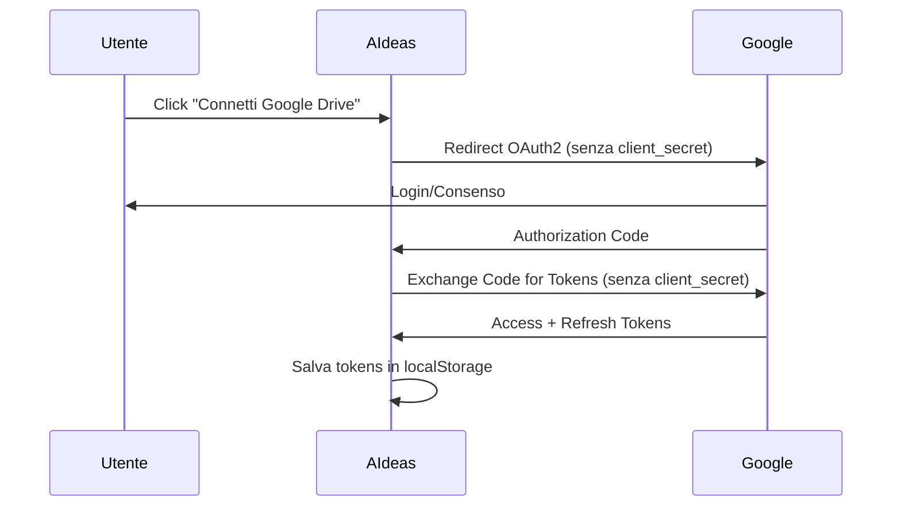

# Google OAuth2 Setup per AIdeas

## Problema Comune: "Configurazione OAuth2 non valida"

Se ricevi l'errore:
```
❌ Configurazione OAuth2 non valida: La tua app Google deve essere configurata come "Public client" per funzionare senza client_secret. Verifica la configurazione OAuth2 nella Google Cloud Console.
```

Segui questa guida per configurare correttamente l'app.

## 🔧 Configurazione Corretta (App Web Pubblica)

### 1. Accedi alla Google Cloud Console
- Vai su [Google Cloud Console](https://console.cloud.google.com/)
- Seleziona il tuo progetto o creane uno nuovo

### 2. Abilita le API necessarie
```bash
# API da abilitare:
- Google Drive API
- Google OAuth2 API
```

### 3. Configura OAuth2 Consent Screen
1. Vai su **APIs & Services > OAuth consent screen**
2. Scegli **External** (per app pubbliche)
3. Compila i campi obbligatori:
   - **App name**: AIdeas
   - **User support email**: la tua email
   - **Developer contact information**: la tua email

### 4. Crea Credenziali OAuth2 (IMPORTANTE)
1. Vai su **APIs & Services > Credentials**
2. Click **Create Credentials > OAuth 2.0 Client IDs**
3. **Application type**: **Web application** ⚠️
4. **Name**: AIdeas Web Client
5. **⚡ Authorized JavaScript origins** (PROBLEMA PIÙ COMUNE):
   ```
   https://aideas.run
   https://www.aideas.run
   http://localhost:3001 (per sviluppo)
   ```
   **🚨 ATTENZIONE**: Questo è il punto che più spesso viene dimenticato!
   **✅ Deve includere ESATTAMENTE il dominio dove gira la tua app**
6. **Authorized redirect URIs**:
   ```
   https://aideas.run/auth/google.html
   https://www.aideas.run/auth/google.html
   http://localhost:3001/auth/google.html (per sviluppo)
   ```

### 5. ⚠️ CONFIGURAZIONE CRITICA per App Pubbliche

**MOLTO IMPORTANTE**: Dopo aver creato le credenziali:

1. **Scarica il JSON delle credenziali**
2. **NON usare client_secret** - AIdeas è progettato per funzionare senza
3. **Copia solo il Client ID** dal file JSON

### 6. Configura le Variabili d'Ambiente

Nel tuo deployment (GitHub Actions/Netlify/Vercel):

```bash
VITE_GOOGLE_CLIENT_ID=il_tuo_client_id_qui.apps.googleusercontent.com
# NON configurare VITE_GOOGLE_CLIENT_SECRET per app pubbliche
```

## 🔍 Verifica Configurazione

### Controllo Rapido
1. Il Client ID termina con `.apps.googleusercontent.com`?
2. **Non** hai configurato `VITE_GOOGLE_CLIENT_SECRET`?
3. L'app type è **Web application**?
4. Gli origins e redirect URIs sono corretti?

### Test di Configurazione
```javascript
// Console del browser - verifica variabili
console.log('Client ID:', import.meta.env.VITE_GOOGLE_CLIENT_ID);
console.log('Client Secret dovrebbe essere undefined:', import.meta.env.VITE_GOOGLE_CLIENT_SECRET);
```

## 🔄 Processo OAuth2 per App Pubbliche

AIdeas usa il flusso **Authorization Code** senza `client_secret`:



## 🚨 Errori Comuni e Soluzioni

### "Client authentication failed"
**Causa**: App configurata come "Confidential" invece di "Public"
**Soluzione**: Ricrea le credenziali come "Web application" senza client_secret

### "redirect_uri_mismatch"
**Causa**: URI di redirect non configurati
**Soluzione**: Aggiungi tutti gli URI necessari nella sezione "Authorized redirect URIs"

### "origin_mismatch" ⚡ (ERRORE PIÙ FREQUENTE)
**Causa**: JavaScript origins non configurati o errati
**Soluzione**: 
1. Vai su Google Cloud Console > Credentials
2. Modifica le credenziali OAuth2
3. Aggiungi ESATTAMENTE il dominio nella sezione "Authorized JavaScript origins"
4. Esempio: `https://aideas.run` (NON `https://aideas.run/` con slash finale)

### "access_denied"
**Causa**: Utente ha negato i permessi o app non pubblicata
**Soluzione**: 
1. Verifica OAuth consent screen
2. Aggiungi utenti di test se l'app è in modalità test

## 🔒 Sicurezza per App Pubbliche

### Perché senza client_secret?
- **Single Page Applications (SPA)** come AIdeas non possono mantenere segreti
- Il codice JavaScript è visibile nel browser
- Google supporta il flusso OAuth2 senza client_secret per SPA

### Meccanismi di Sicurezza
1. **CORS**: Restrizioni Cross-Origin
2. **Origins Autorizzati**: Solo domini specifici
3. **Redirect URIs**: Solo URI pre-autorizzati
4. **Short-lived tokens**: Token di accesso con scadenza
5. **Refresh tokens**: Per rinnovo sicuro

## 📝 Checklist Finale

- [ ] Progetto Google Cloud creato
- [ ] Drive API abilitata
- [ ] OAuth consent screen configurato
- [ ] Credenziali create come "Web application"
- [ ] JavaScript origins configurati
- [ ] Redirect URIs configurati
- [ ] Solo Client ID copiato (NO client_secret)
- [ ] Variabile VITE_GOOGLE_CLIENT_ID impostata
- [ ] Test di autenticazione completato

## 🆘 Debug Avanzato

Se i problemi persistono:

1. **Verifica Network Tab** del browser durante l'autenticazione
2. **Controlla Console** per errori JavaScript
3. **Testa manualmente** l'URL OAuth2 generato
4. **Verifica timestamp** - orologio di sistema sincronizzato?

## 📞 Supporto

Se dopo aver seguito questa guida il problema persiste:

1. Verifica che il progetto Google Cloud sia attivo
2. Controlla i quota limits delle API
3. Aspetta qualche minuto per la propagazione delle modifiche
4. Prova in modalità incognito per escludere problemi di cache 