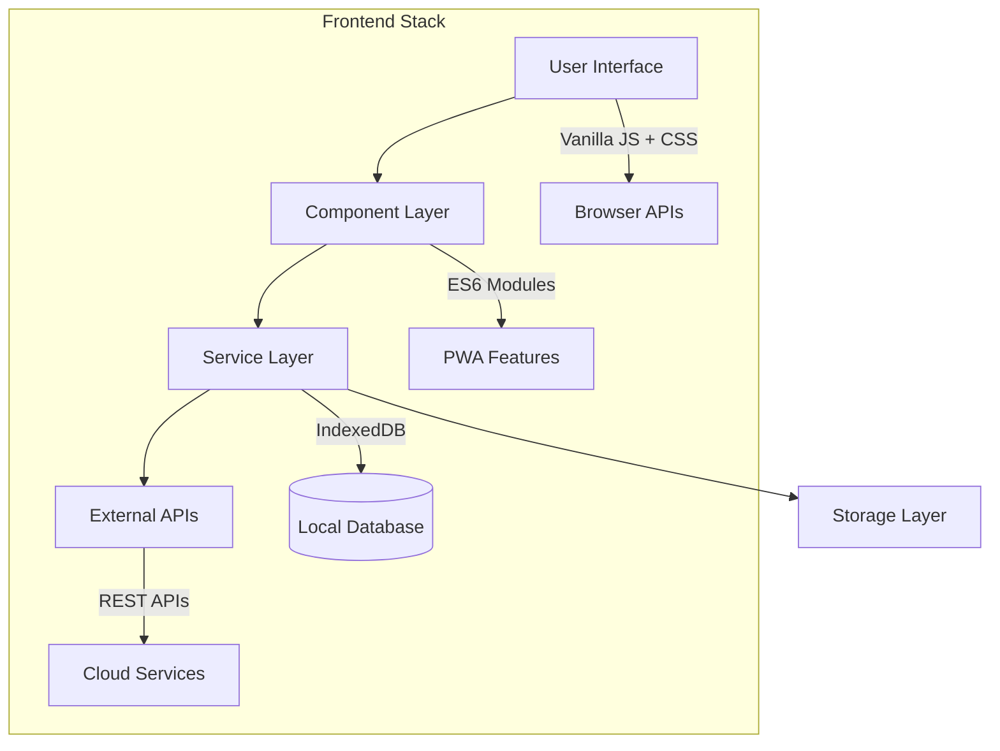

# 🔧 Developer Guide - SAKAI

> **Guida completa per sviluppatori che vogliono contribuire, estendere o customizzare SAKAI**

## 📋 Indice

- [Architettura del Sistema](#-architettura-del-sistema)
- [Struttura del Codice](#-struttura-del-codice)
- [Design Patterns](#-design-patterns)
- [API Interne](#-api-interne)
- [Estensione di SAKAI](#-estensione-di-sakai)
- [Testing](#-testing)
- [Debugging](#-debugging)
- [Contribuire](#-contribuire)
- [Deployment](#-deployment)
- [Best Practices](#-best-practices)

---

## 🔧 Problemi Risolti

### 1. File HTML Incompleto

**Problema**: Il file `index.html` nella root del progetto conteneva solo la struttura base senza il contenuto completo dell'applicazione.

**Soluzione**: 
- Sostituito il contenuto con quello completo da `public/index.html`
- Il file ora include tutta la struttura HTML necessaria per l'applicazione

**File modificato**: `index.html`

### 2. Configurazione Vite Errata

**Problema**: Il file `vite.config.js` conteneva un percorso assoluto errato per il file HTML di input.

```javascript
// ERRATO
input: {
  main: '/Users/antonello/Downloads/SAKAI/public/index.html'
}

// CORRETTO
input: {
  main: './index.html'
}
```

**Soluzione**: Corretto il percorso per utilizzare un percorso relativo.

**File modificato**: `vite.config.js`

### 3. Dipendenze con Vulnerabilità

**Problema**: Alcune dipendenze presentavano vulnerabilità di sicurezza moderate.

**Soluzione**: 
- Eseguire `npm audit fix` per risolvere le vulnerabilità
- Aggiornare le dipendenze obsolete quando possibile

## 🏗️ Architettura del Sistema

### Overview Generale

SAKAI segue un'architettura **modulare client-side** con i seguenti principi:



### Principi Architetturali

1. **Client-Side First**: Tutto funziona offline
2. **Progressive Enhancement**: Funzionalità cloud opzionali
3. **Modular Design**: Componenti sostituibili
4. **Security by Design**: Sandbox e validazione
5. **Performance Oriented**: Lazy loading e cache intelligente

### Stack Tecnologico

| Layer | Tecnologie | Ruolo |
|-------|------------|-------|
| **UI** | Vanilla JS, CSS Grid/Flexbox | Interfaccia utente reattiva |
| **State** | Custom State Management | Gestione stato applicazione |
| **Data** | IndexedDB + Dexie.js | Database locale persistente |
| **Networking** | Fetch API, WebSockets | Comunicazione esterna |
| **Security** | Web APIs, Sandboxing | Isolamento e sicurezza |
| **Build** | Vite, Rollup | Bundling e ottimizzazione |

### Struttura Modulare

SAKAI utilizza un'architettura modulare basata su ES6 modules:

```
src/
├── main.js              # Entry point principale
├── components/          # Componenti UI
├── services/           # Servizi business logic
├── utils/              # Utilità e helpers
└── styles/             # Stili CSS/SCSS
```

### Componenti Principali

#### 1. SakaiApp (main.js)
- Classe principale che coordina tutti i componenti
- Gestisce l'inizializzazione dell'applicazione
- Gestisce eventi globali e routing

#### 2. StorageService
- Singleton per gestione IndexedDB con Dexie.js
- Gestisce app, impostazioni, file e sincronizzazione
- Fornisce API per CRUD operations

#### 3. AppLauncher
- Gestisce il lancio sicuro delle applicazioni
- Supporta modalità iframe e nuova pagina
- Implementa sandbox per sicurezza

#### 4. AppImporter
- Gestisce import da ZIP, URL, GitHub
- Validazione file e metadati
- Estrazione e processing dei file

### Database Schema

```javascript
// IndexedDB con Dexie.js
const schema = {
  apps: '++id, name, description, category, version, url, type, githubUrl, installDate, lastUsed, favorite, *tags',
  appFiles: '++id, appId, filename, content, size, mimeType',
  settings: 'key, value, lastModified',
  syncEvents: '++id, timestamp, action, data, synced, deviceId',
  catalog: '++id, name, description, author, githubUrl, rating, downloads, featured, *categories'
};
```

## 🎨 Design Patterns

### 1. Module Pattern

Ogni componente è un modulo ES6 self-contained:

```javascript
// src/components/ExampleComponent.js
export default class ExampleComponent {
  constructor(options = {}) {
    this.options = { ...this.defaults, ...options };
    this.init();
  }

  async init() {
    // Inizializzazione asincrona
  }

  // Public API
  async publicMethod() {
    return await this.privateMethod();
  }

  // Private methods
  async privateMethod() {
    // Implementation
  }
}
```

### 2. Service Layer Pattern

I servizi gestiscono la logica di business:

```javascript
// src/services/ExampleService.js
class ExampleService {
  static instance = null;
  
  constructor() {
    if (ExampleService.instance) {
      return ExampleService.instance;
    }
    
    this.cache = new Map();
    ExampleService.instance = this;
  }

  // Singleton pattern
  static getInstance() {
    if (!ExampleService.instance) {
      ExampleService.instance = new ExampleService();
    }
    return ExampleService.instance;
  }

  async fetchData(id) {
    // Cache-first strategy
    if (this.cache.has(id)) {
      return this.cache.get(id);
    }

    const data = await this.performFetch(id);
    this.cache.set(id, data);
    return data;
  }
}

export default ExampleService.getInstance();
```

### 3. Observer Pattern

Per eventi e notifiche:

```javascript
// src/utils/EventEmitter.js
class EventEmitter {
  constructor() {
    this.events = new Map();
  }

  on(event, callback) {
    if (!this.events.has(event)) {
      this.events.set(event, []);
    }
    this.events.get(event).push(callback);
  }

  emit(event, data) {
    if (!this.events.has(event)) return;
    
    this.events.get(event).forEach(callback => {
      try {
        callback(data);
      } catch (error) {
        console.error('Event callback error:', error);
      }
    });
  }

  off(event, callback) {
    if (!this.events.has(event)) return;
    
    const callbacks = this.events.get(event);
    const index = callbacks.indexOf(callback);
    if (index > -1) {
      callbacks.splice(index, 1);
    }
  }
}

export default new EventEmitter();
```

### 4. Factory Pattern

Per creare istanze basate su tipo:

```javascript
// src/components/AppFactory.js
export class AppFactory {
  static createImporter(type) {
    switch (type) {
      case 'zip':
        return new ZipImporter();
      case 'url':
        return new UrlImporter();
      case 'github':
        return new GitHubImporter();
      default:
        throw new Error(`Unknown importer type: ${type}`);
    }
  }

  static createLauncher(mode) {
    return mode === 'iframe' 
      ? new IframeLauncher() 
      : new WindowLauncher();
  }
}
```

### 5. Strategy Pattern

Per algoritmi interscambiabili:

```javascript
// src/services/SyncStrategy.js
export class SyncStrategy {
  constructor(provider) {
    this.strategies = {
      github: new GitHubSyncStrategy(),
      googledrive: new GoogleDriveSyncStrategy()
    };
    
    this.currentStrategy = this.strategies[provider];
  }

  async sync(data) {
    return await this.currentStrategy.execute(data);
  }
}
```

---

## 🔌 API Interne

### StorageService API

Database layer principale:

```javascript
import StorageService from '@/services/StorageService.js';

// App Management
const apps = await StorageService.getAllApps();
const app = await StorageService.getApp(id);
const appId = await StorageService.installApp(appData);
await StorageService.updateApp(id, data);
await StorageService.deleteApp(id);

// File Management
await StorageService.saveAppFiles(appId, files);
const files = await StorageService.getAppFiles(appId);

// Settings
await StorageService.setSetting(key, value);
const value = await StorageService.getSetting(key, defaultValue);
const settings = await StorageService.getAllSettings();

// Search & Filter
const results = await StorageService.searchApps(query);
const favorites = await StorageService.getFavoriteApps();

// Statistics
const stats = await StorageService.getStats();
```

### Component Lifecycle

Ogni componente segue questo ciclo:

```javascript
class Component {
  constructor(options) {
    // 1. Setup iniziale
    this.options = options;
    this.state = {};
  }

  async init() {
    // 2. Inizializzazione asincrona
    await this.loadData();
    this.setupEventListeners();
    this.render();
  }

  async loadData() {
    // 3. Caricamento dati
  }

  setupEventListeners() {
    // 4. Setup eventi
  }

  render() {
    // 5. Rendering UI
  }

  destroy() {
    // 6. Cleanup
    this.removeEventListeners();
    this.clearState();
  }
}
```

### Event System

Sistema di eventi custom:

```javascript
import { CUSTOM_EVENTS } from '@/utils/constants.js';

// Emit evento
document.dispatchEvent(new CustomEvent(CUSTOM_EVENTS.APP_LAUNCHED, {
  detail: { appId: 123, appName: 'My App' }
}));

// Listen evento
document.addEventListener(CUSTOM_EVENTS.APP_LAUNCHED, (event) => {
  console.log('App launched:', event.detail);
});

// Cleanup
document.removeEventListener(CUSTOM_EVENTS.APP_LAUNCHED, handler);
```

### Error Handling

Sistema di gestione errori centralizzato:

```javascript
// src/utils/ErrorHandler.js
class ErrorHandler {
  static handle(error, context = {}) {
    // Log error
    console.error('[SAKAI Error]', error, context);
    
    // Report to service (if enabled)
    if (this.shouldReport(error)) {
      this.reportError(error, context);
    }
    
    // Show user notification
    this.showUserNotification(error);
  }

  static async reportError(error, context) {
    // Send to analytics service
  }

  static showUserNotification(error) {
    const userMessage = this.getUserMessage(error);
    showToast(userMessage, 'error');
  }
}

// Usage
try {
  await riskyOperation();
} catch (error) {
  ErrorHandler.handle(error, { operation: 'importApp' });
}
```

---

## 🔧 Estensione di SAKAI

### Creare un Nuovo Componente

1. **Struttura base**:

```javascript
// src/components/MyCustomComponent.js
import { showToast } from '@/utils/helpers.js';
import StorageService from '@/services/StorageService.js';

export default class MyCustomComponent {
  constructor(container, options = {}) {
    this.container = container;
    this.options = {
      // Defaults
      autoInit: true,
      theme: 'default',
      ...options
    };
    
    if (this.options.autoInit) {
      this.init();
    }
  }

  async init() {
    try {
      await this.loadData();
      this.setupEventListeners();
      this.render();
    } catch (error) {
      console.error('Component init failed:', error);
      showToast('Errore inizializzazione componente', 'error');
    }
  }

  async loadData() {
    // Load required data
    this.data = await StorageService.getSetting('myComponentData', []);
  }

  setupEventListeners() {
    // Event listeners
    this.handleClick = this.handleClick.bind(this);
    this.container.addEventListener('click', this.handleClick);
  }

  render() {
    this.container.innerHTML = this.getTemplate();
  }

  getTemplate() {
    return `
      <div class="my-custom-component">
        <h3>My Custom Component</h3>
        <button class="action-btn">Click Me</button>
      </div>
    `;
  }

  handleClick(event) {
    if (event.target.classList.contains('action-btn')) {
      this.performAction();
    }
  }

  async performAction() {
    // Custom logic here
    showToast('Action performed!', 'success');
  }

  destroy() {
    this.container.removeEventListener('click', this.handleClick);
    this.container.innerHTML = '';
  }
}
```

2. **Registrazione nel sistema**:

```javascript
// src/main.js
import MyCustomComponent from '@/components/MyCustomComponent.js';

// Durante l'inizializzazione dell'app
const customComponent = new MyCustomComponent(
  document.getElementById('custom-container'),
  { theme: 'dark' }
);
```

### Creare un Nuovo Servizio

```javascript
// src/services/MyCustomService.js
class MyCustomService {
  constructor() {
    this.cache = new Map();
    this.apiEndpoint = 'https://api.example.com';
  }

  async fetchExternalData(params) {
    const cacheKey = JSON.stringify(params);
    
    if (this.cache.has(cacheKey)) {
      return this.cache.get(cacheKey);
    }

    try {
      const response = await fetch(`${this.apiEndpoint}/data`, {
        method: 'POST',
        headers: { 'Content-Type': 'application/json' },
        body: JSON.stringify(params)
      });

      if (!response.ok) {
        throw new Error(`API error: ${response.statusText}`);
      }

      const data = await response.json();
      this.cache.set(cacheKey, data);
      
      return data;
    } catch (error) {
      console.error('Service error:', error);
      throw error;
    }
  }

  clearCache() {
    this.cache.clear();
  }
}

export default new MyCustomService();
```

### Plugin System

Sistema di plugin per estensibilità:

```javascript
// src/utils/PluginManager.js
class PluginManager {
  constructor() {
    this.plugins = new Map();
    this.hooks = new Map();
  }

  register(plugin) {
    if (!plugin.name || !plugin.version) {
      throw new Error('Plugin must have name and version');
    }

    this.plugins.set(plugin.name, plugin);
    
    // Initialize plugin
    if (typeof plugin.init === 'function') {
      plugin.init(this.getAPIContext());
    }

    console.log(`✅ Plugin registered: ${plugin.name} v${plugin.version}`);
  }

  unregister(pluginName) {
    const plugin = this.plugins.get(pluginName);
    if (plugin && typeof plugin.destroy === 'function') {
      plugin.destroy();
    }
    
    this.plugins.delete(pluginName);
  }

  addHook(hookName, callback) {
    if (!this.hooks.has(hookName)) {
      this.hooks.set(hookName, []);
    }
    this.hooks.get(hookName).push(callback);
  }

  async executeHook(hookName, data) {
    if (!this.hooks.has(hookName)) return data;
    
    let result = data;
    for (const callback of this.hooks.get(hookName)) {
      try {
        result = await callback(result);
      } catch (error) {
        console.error(`Hook ${hookName} error:`, error);
      }
    }
    return result;
  }

  getAPIContext() {
    return {
      StorageService,
      showToast,
      addHook: this.addHook.bind(this),
      executeHook: this.executeHook.bind(this)
    };
  }
}

export default new PluginManager();
```

### Esempio Plugin

```javascript
// plugins/MyAwesomePlugin.js
const MyAwesomePlugin = {
  name: 'MyAwesomePlugin',
  version: '1.0.0',
  description: 'An awesome plugin for SAKAI',

  init(api) {
    this.api = api;
    
    // Add custom hook
    api.addHook('app:beforeLaunch', this.beforeAppLaunch.bind(this));
    
    // Add custom UI
    this.addCustomUI();
  },

  async beforeAppLaunch(appData) {
    console.log('Plugin: App about to launch:', appData.name);
    
    // Modify app data if needed
    appData.customField = 'Modified by plugin';
    
    return appData;
  },

  addCustomUI() {
    const container = document.getElementById('plugin-container');
    if (container) {
      container.innerHTML += `
        <div class="plugin-widget">
          <h4>My Awesome Plugin</h4>
          <button onclick="this.doSomething()">Plugin Action</button>
        </div>
      `;
    }
  },

  doSomething() {
    this.api.showToast('Plugin action executed!', 'success');
  },

  destroy() {
    // Cleanup when plugin is unregistered
    const widget = document.querySelector('.plugin-widget');
    if (widget) {
      widget.remove();
    }
  }
};

// Register plugin
PluginManager.register(MyAwesomePlugin);
```

---

## 🧪 Testing

### Test Structure

```
tests/
├── unit/                         # Unit tests
│   ├── services/
│   │   ├── StorageService.test.js
│   │   └── GitHubService.test.js
│   ├── components/
│   │   └── AppCard.test.js
│   └── utils/
│       └── helpers.test.js
├── integration/                  # Integration tests
│   ├── app-import.test.js
│   └── sync-workflow.test.js
└── e2e/                         # End-to-end tests
    ├── user-journey.test.js
    └── pwa-functionality.test.js
```

### Unit Testing

```javascript
// tests/unit/services/StorageService.test.js
import { describe, it, expect, beforeEach, afterEach } from 'vitest';
import StorageService from '@/services/StorageService.js';

describe('StorageService', () => {
  beforeEach(async () => {
    // Setup test database
    await StorageService.init();
  });

  afterEach(async () => {
    // Cleanup
    await StorageService.clearAllData();
  });

  it('should save and retrieve app', async () => {
    const appData = {
      name: 'Test App',
      description: 'Test Description',
      type: 'url',
      url: 'https://example.com'
    };

    const appId = await StorageService.installApp(appData);
    expect(appId).toBeDefined();

    const retrievedApp = await StorageService.getApp(appId);
    expect(retrievedApp.name).toBe('Test App');
    expect(retrievedApp.type).toBe('url');
  });

  it('should handle app search', async () => {
    // Install test apps
    await StorageService.installApp({ name: 'Calculator', type: 'url' });
    await StorageService.installApp({ name: 'Calendar', type: 'zip' });

    const results = await StorageService.searchApps('cal');
    expect(results).toHaveLength(2);
    expect(results.every(app => app.name.toLowerCase().includes('cal'))).toBe(true);
  });
});
```

### Integration Testing

```javascript
// tests/integration/app-import.test.js
import { describe, it, expect } from 'vitest';
import AppImporter from '@/components/AppImporter.js';
import StorageService from '@/services/StorageService.js';

describe('App Import Workflow', () => {
  it('should import app from URL', async () => {
    const importer = new AppImporter();
    
    const result = await importer.importFromUrl('https://example.com', {
      name: 'Example App',
      category: 'tools'
    });

    expect(result.success).toBe(true);
    expect(result.appId).toBeDefined();

    // Verify app was saved
    const savedApp = await StorageService.getApp(result.appId);
    expect(savedApp.name).toBe('Example App');
    expect(savedApp.url).toBe('https://example.com');
  });
});
```

### E2E Testing (Playwright)

```javascript
// tests/e2e/user-journey.test.js
import { test, expect } from '@playwright/test';

test('complete user journey', async ({ page }) => {
  await page.goto('http://localhost:3000');

  // Check initial load
  await expect(page.locator('h1')).toContainText('SAKAI');

  // Add new app
  await page.click('[data-testid="add-app-btn"]');
  await page.fill('[data-testid="app-name"]', 'Test App');
  await page.fill('[data-testid="app-url"]', 'https://example.com');
  await page.click('[data-testid="save-app"]');

  // Verify app appears in list
  await expect(page.locator('[data-testid="app-card"]')).toBeVisible();
  await expect(page.locator('[data-testid="app-card"] h3')).toContainText('Test App');

  // Launch app
  await page.click('[data-testid="app-card"] [data-testid="launch-btn"]');
  await expect(page.locator('[data-testid="app-modal"]')).toBeVisible();
});
```

### Test Configuration

```javascript
// vitest.config.js
import { defineConfig } from 'vitest/config';
import path from 'path';

export default defineConfig({
  test: {
    environment: 'jsdom',
    setupFiles: ['./tests/setup.js'],
    globals: true
  },
  resolve: {
    alias: {
      '@': path.resolve(__dirname, './src')
    }
  }
});
```

```javascript
// tests/setup.js
import 'fake-indexeddb/auto';
import { vi } from 'vitest';

// Mock browser APIs
global.navigator = {
  serviceWorker: {
    register: vi.fn(),
    ready: Promise.resolve({})
  }
};

// Mock storage APIs
global.localStorage = {
  getItem: vi.fn(),
  setItem: vi.fn(),
  removeItem: vi.fn(),
  clear: vi.fn()
};
```

---

## 🐛 Debugging

### Debug Configuration

```javascript
// src/utils/debug.js
export const DEBUG = {
  enabled: import.meta.env.DEV || localStorage.getItem('sakai_debug') === 'true',
  verbose: localStorage.getItem('sakai_verbose') === 'true',
  
  log(...args) {
    if (this.enabled) {
      console.log('[SAKAI Debug]', ...args);
    }
  },
  
  warn(...args) {
    if (this.enabled) {
      console.warn('[SAKAI Debug]', ...args);
    }
  },
  
  error(...args) {
    console.error('[SAKAI Debug]', ...args);
  },
  
  table(data) {
    if (this.enabled) {
      console.table(data);
    }
  },
  
  group(label) {
    if (this.enabled) {
      console.group(label);
    }
  },
  
  groupEnd() {
    if (this.enabled) {
      console.groupEnd();
    }
  }
};
```

### Performance Monitoring

```javascript
// src/utils/performance.js
export class PerformanceMonitor {
  static marks = new Map();
  
  static mark(name) {
    const markName = `sakai:${name}`;
    performance.mark(markName);
    this.marks.set(name, performance.now());
  }
  
  static measure(name, startMark) {
    const measureName = `sakai:${name}`;
    const startMarkName = `sakai:${startMark}`;
    
    try {
      performance.measure(measureName, startMarkName);
      const entries = performance.getEntriesByName(measureName);
      const duration = entries[entries.length - 1].duration;
      
      DEBUG.log(`Performance: ${name} took ${duration.toFixed(2)}ms`);
      
      return duration;
    } catch (error) {
      DEBUG.warn('Performance measure failed:', error);
      return null;
    }
  }
  
  static getMetrics() {
    return {
      navigation: performance.getEntriesByType('navigation')[0],
      resources: performance.getEntriesByType('resource'),
      marks: performance.getEntriesByType('mark'),
      measures: performance.getEntriesByType('measure')
    };
  }
}

// Usage
PerformanceMonitor.mark('app-init-start');
// ... app initialization
PerformanceMonitor.mark('app-init-end');
PerformanceMonitor.measure('app-init', 'app-init-start');
```

### Error Tracking

```javascript
// src/utils/errorTracking.js
class ErrorTracker {
  constructor() {
    this.errors = [];
    this.maxErrors = 100;
    
    // Global error handlers
    window.addEventListener('error', this.handleError.bind(this));
    window.addEventListener('unhandledrejection', this.handleRejection.bind(this));
  }
  
  handleError(event) {
    const error = {
      type: 'javascript',
      message: event.message,
      filename: event.filename,
      lineno: event.lineno,
      colno: event.colno,
      stack: event.error?.stack,
      timestamp: new Date().toISOString(),
      userAgent: navigator.userAgent,
      url: window.location.href
    };
    
    this.recordError(error);
  }
  
  handleRejection(event) {
    const error = {
      type: 'promise',
      message: event.reason?.message || 'Unhandled Promise Rejection',
      stack: event.reason?.stack,
      timestamp: new Date().toISOString(),
      userAgent: navigator.userAgent,
      url: window.location.href
    };
    
    this.recordError(error);
  }
  
  recordError(error) {
    this.errors.push(error);
    
    // Keep only last N errors
    if (this.errors.length > this.maxErrors) {
      this.errors.shift();
    }
    
    DEBUG.error('Error recorded:', error);
    
    // Report to external service if configured
    if (this.shouldReport(error)) {
      this.reportError(error);
    }
  }
  
  shouldReport(error) {
    // Don't report in development
    if (import.meta.env.DEV) return false;
    
    // Check user consent
    return localStorage.getItem('sakai_error_reporting') === 'true';
  }
  
  async reportError(error) {
    try {
      await fetch('/api/errors', {
        method: 'POST',
        headers: { 'Content-Type': 'application/json' },
        body: JSON.stringify(error)
      });
    } catch (e) {
      DEBUG.warn('Failed to report error:', e);
    }
  }
  
  getErrors() {
    return [...this.errors];
  }
  
  clearErrors() {
    this.errors = [];
  }
}

export default new ErrorTracker();
```

### Development Tools

```javascript
// Development console tools
if (import.meta.env.DEV) {
  window.SAKAI_DEV = {
    // Storage inspection
    async inspectStorage() {
      const stats = await StorageService.getStats();
      const apps = await StorageService.getAllApps();
      const settings = await StorageService.getAllSettings();
      
      console.group('🔍 SAKAI Storage Inspection');
      console.log('Stats:', stats);
      console.table(apps);
      console.log('Settings:', settings);
      console.groupEnd();
    },
    
    // Performance metrics
    getPerformance() {
      return PerformanceMonitor.getMetrics();
    },
    
    // Error log
    getErrors() {
      return ErrorTracker.getErrors();
    },
    
    // Clear all data
    async clearAll() {
      if (confirm('Clear all SAKAI data? This cannot be undone!')) {
        await StorageService.clearAllData();
        localStorage.clear();
        location.reload();
      }
    },
    
    // Enable verbose logging
    enableVerbose() {
      localStorage.setItem('sakai_verbose', 'true');
      location.reload();
    }
  };
  
  console.log('🛠️ SAKAI Development tools available at window.SAKAI_DEV');
}
```

---

## 🤝 Contribuire

### Workflow di Contribuzione

1. **Fork** il repository
2. **Clone** il fork localmente
3. **Crea** branch feature: `git checkout -b feature/my-feature`
4. **Sviluppa** e **testa** le modifiche
5. **Commit** con messaggi descrittivi
6. **Push** al fork: `git push origin feature/my-feature`
7. **Apri** Pull Request

### Commit Guidelines

Usiamo [Conventional Commits](https://www.conventionalcommits.org/):

```bash
# Features
git commit -m "feat: add GitHub sync functionality"

# Bug fixes
git commit -m "fix: resolve app import validation issue"

# Documentation
git commit -m "docs: update installation guide"

# Refactoring
git commit -m "refactor: improve StorageService performance"

# Tests
git commit -m "test: add unit tests for AppLauncher"

# Chores
git commit -m "chore: update dependencies"
```

### Code Review Process

1. **Automated checks** devono passare:
   - Linting (ESLint)
   - Type checking
   - Unit tests
   - E2E tests
   - Build verification

2. **Manual review** da maintainer:
   - Code quality
   - Architecture consistency
   - Performance impact
   - Security considerations
   - Documentation completeness

3. **Testing requirements**:
   - Nuove features devono avere test
   - Bug fixes devono avere test di regressione
   - Coverage minimo: 80%

### Development Standards

#### Code Style

```javascript
// ✅ Good
const myFunction = async (param1, param2) => {
  try {
    const result = await someAsyncOperation(param1);
    return processResult(result, param2);
  } catch (error) {
    console.error('Operation failed:', error);
    throw error;
  }
};

// ❌ Bad
function myFunction(param1,param2){
  return someAsyncOperation(param1).then(result=>{
    return processResult(result,param2)
  }).catch(error=>{
    console.log(error)
  })
}
```

#### Error Handling

```javascript
// ✅ Good - Specific error handling
try {
  await riskyOperation();
} catch (error) {
  if (error instanceof ValidationError) {
    showUserError('Invalid input provided');
  } else if (error instanceof NetworkError) {
    showUserError('Network connection failed');
  } else {
    ErrorTracker.recordError(error);
    showUserError('An unexpected error occurred');
  }
}

// ❌ Bad - Generic catch-all
try {
  await riskyOperation();
} catch (error) {
  console.log('Error:', error);
}
```

#### Performance Considerations

```javascript
// ✅ Good - Debounced search
const debouncedSearch = debounce(async (query) => {
  const results = await searchApps(query);
  updateUI(results);
}, 300);

// ✅ Good - Lazy loading
const loadAppDetails = async (appId) => {
  if (appDetailsCache.has(appId)) {
    return appDetailsCache.get(appId);
  }
  
  const details = await fetchAppDetails(appId);
  appDetailsCache.set(appId, details);
  return details;
};

// ❌ Bad - No debouncing, no caching
searchInput.addEventListener('input', async (e) => {
  const results = await searchApps(e.target.value);
  updateUI(results);
});
```

---

## 🚀 Deployment

### Environment Configuration

```javascript
// config/environments.js
export const environments = {
  development: {
    apiBaseUrl: 'http://localhost:3000',
    enableDebug: true,
    enableAnalytics: false,
    enableServiceWorker: false
  },
  
  staging: {
    apiBaseUrl: 'https://staging.sakai.dev',
    enableDebug: true,
    enableAnalytics: false,
    enableServiceWorker: true
  },
  
  production: {
    apiBaseUrl: 'https://sakai.dev',
    enableDebug: false,
    enableAnalytics: true,
    enableServiceWorker: true
  }
};
```

### Build Pipeline

```yaml
# .github/workflows/deploy.yml
name: Deploy SAKAI

on:
  push:
    branches: [main]

jobs:
  test:
    runs-on: ubuntu-latest
    steps:
      - uses: actions/checkout@v3
      - uses: actions/setup-node@v3
        with:
          node-version: '18'
      - run: npm ci
      - run: npm run lint
      - run: npm run test
      - run: npm run build

  deploy:
    needs: test
    runs-on: ubuntu-latest
    steps:
      - uses: actions/checkout@v3
      - uses: actions/setup-node@v3
        with:
          node-version: '18'
      - run: npm ci
      - run: npm run build
      - uses: peaceiris/actions-gh-pages@v3
        with:
          github_token: ${{ secrets.GITHUB_TOKEN }}
          publish_dir: ./dist
```

### Release Process

```bash
# 1. Update version
npm version patch  # or minor, major

# 2. Update changelog
echo "## v1.0.1\n- Bug fixes\n- Performance improvements" >> CHANGELOG.md

# 3. Commit and tag
git add .
git commit -m "chore: release v1.0.1"
git tag v1.0.1

# 4. Push
git push origin main --tags

# 5. Create GitHub release
gh release create v1.0.1 --title "Release v1.0.1" --notes-file CHANGELOG.md
```

---

## 📝 Best Practices

### Security

1. **Input Validation**:
   ```javascript
   const validateAppData = (data) => {
     const schema = {
       name: { type: 'string', maxLength: 100, required: true },
       url: { type: 'string', pattern: /^https?:\/\/.+/ },
       description: { type: 'string', maxLength: 500 }
     };
     
     return validateSchema(data, schema);
   };
   ```

2. **Sanitization**:
   ```javascript
   import DOMPurify from 'dompurify';
   
   const sanitizeHTML = (html) => {
     return DOMPurify.sanitize(html, {
       ALLOWED_TAGS: ['b', 'i', 'em', 'strong', 'p'],
       ALLOWED_ATTR: []
     });
   };
   ```

3. **CSP Headers**:
   ```javascript
   const CSP_POLICY = {
     'default-src': "'self'",
     'script-src': "'self' 'unsafe-inline' https://cdnjs.cloudflare.com",
     'style-src': "'self' 'unsafe-inline'",
     'img-src': "'self' data: https:",
     'connect-src': "'self' https://api.github.com https://www.googleapis.com"
   };
   ```

### Performance

1. **Lazy Loading**:
   ```javascript
   const lazyLoadComponent = async (componentName) => {
     const { default: Component } = await import(`./components/${componentName}.js`);
     return Component;
   };
   ```

2. **Caching Strategy**:
   ```javascript
   class CacheManager {
     constructor() {
       this.memory = new Map();
       this.storage = localStorage;
     }
     
     async get(key) {
       // 1. Check memory cache
       if (this.memory.has(key)) {
         return this.memory.get(key);
       }
       
       // 2. Check persistent storage
       const stored = this.storage.getItem(key);
       if (stored) {
         const data = JSON.parse(stored);
         this.memory.set(key, data);
         return data;
       }
       
       return null;
     }
   }
   ```

3. **Bundle Optimization**:
   ```javascript
   // vite.config.js
   export default defineConfig({
     build: {
       rollupOptions: {
         output: {
           manualChunks: {
             vendor: ['dexie'],
             utils: ['lodash-es', 'date-fns']
           }
         }
       }
     }
   });
   ```

### Accessibility

1. **ARIA Labels**:
   ```javascript
   const createAccessibleButton = (text, action) => {
     const button = document.createElement('button');
     button.textContent = text;
     button.setAttribute('aria-label', `${text} - ${action}`);
     button.setAttribute('role', 'button');
     return button;
   };
   ```

2. **Keyboard Navigation**:
   ```javascript
   document.addEventListener('keydown', (event) => {
     if (event.key === 'Tab') {
       // Ensure proper tab order
       manageFocusOrder(event);
     }
     
     if (event.key === 'Escape') {
       // Close modals/menus
       closeActiveModals();
     }
   });
   ```

3. **Screen Reader Support**:
   ```javascript
   const announceToScreenReader = (message) => {
     const announcement = document.createElement('div');
     announcement.setAttribute('aria-live', 'polite');
     announcement.textContent = message;
     announcement.style.position = 'absolute';
     announcement.style.left = '-10000px';
     
     document.body.appendChild(announcement);
     setTimeout(() => document.body.removeChild(announcement), 1000);
   };
   ```

---

## 📚 Risorse per Sviluppatori

### Documentazione API

- [IndexedDB API](https://developer.mozilla.org/en-US/docs/Web/API/IndexedDB_API)
- [Service Worker API](https://developer.mozilla.org/en-US/docs/Web/API/Service_Worker_API)
- [Web App Manifest](https://developer.mozilla.org/en-US/docs/Web/Manifest)
- [GitHub REST API](https://docs.github.com/en/rest)
- [Google Drive API](https://developers.google.com/drive/api)

### Tools e Utilities

- [Vite Documentation](https://vitejs.dev/)
- [Dexie.js Guide](https://dexie.org/)
- [Vitest Testing](https://vitest.dev/)
- [Playwright E2E](https://playwright.dev/)

### Community

- [GitHub Discussions](https://github.com/sakai/sakai/discussions)
- [Discord Developer Channel](https://discord.gg/sakai-dev)
- [Stack Overflow](https://stackoverflow.com/questions/tagged/sakai)

---

<p align="center">
  <strong>Happy Coding! 🚀</strong><br>
  <a href="https://github.com/sakai/sakai/issues">Report Issues</a> • 
  <a href="https://github.com/sakai/sakai/pulls">Submit PR</a> • 
  <a href="https://discord.gg/sakai-dev">Join Community</a>
</p>